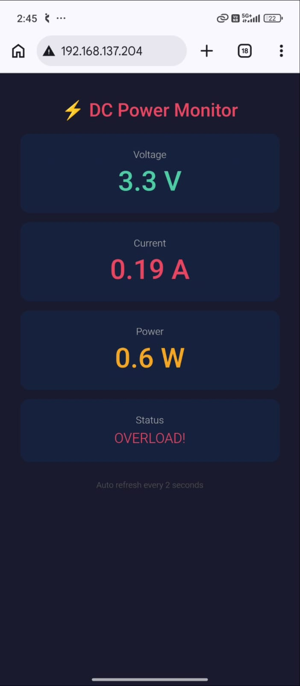
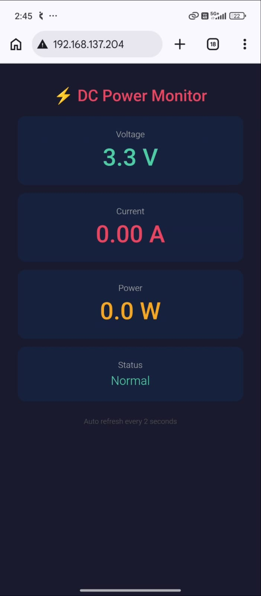
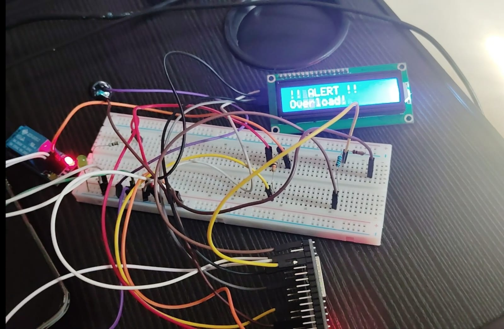
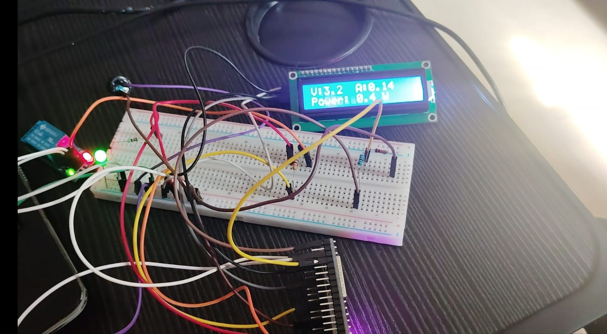

# DC Power Monitor — ESP32

Real-time DC energy monitoring system built on ESP32 with 
ACS712 current sensing, automated overload protection, 
and WiFi-hosted live web dashboard.

---

## Project Photos

### WiFi Dashboard

### Circuit Setup

## Features
- Real-time voltage, current & power measurement
- 16x2 LCD live display via I2C
- WiFi web dashboard — no external cloud needed
- Automatic relay cutoff on overload
- Buzzer + LED alert system
- Modular firmware architecture

---

## Hardware Used
| Component | Details |
|---|---|
| ESP32 NodeMCU | 38-pin, WiFi + Bluetooth |
| ACS712 5A | Hall Effect current sensor |
| Voltage Divider | 10K + 1K resistors |
| 16x2 LCD | I2C interface (0x27) |
| 5V Relay | BC547 transistor driver |
| Passive Buzzer | GPIO4 |
| Green LED | GPIO2, 220 ohm |

---

## Pin Connections
| Component | ESP32 Pin | Protocol |
|---|---|---|
| ACS712 OUT | GPIO36 (VP) | ADC |
| Voltage Divider | GPIO39 (VN) | ADC |
| LCD SDA | GPIO21 | I2C |
| LCD SCL | GPIO22 | I2C |
| Relay (BC547) | GPIO5 | Digital |
| Buzzer | GPIO4 | Digital |
| Green LED | GPIO2 | Digital |

---

## How It Works
1. ACS712 measures current using Hall Effect (series connection)
2. Voltage divider scales supply voltage for ESP32 ADC (max 3.3V)
3. ESP32 calculates Power = Voltage x Current
4. LCD displays live V, A, W readings
5. WiFi web server hosts dashboard on phone browser
6. Relay auto-cuts load on overload (>4.5A or >20W)
7. Buzzer + LED alert on overload

---

## Libraries Required
- LiquidCrystal_I2C — Frank de Brabander

---

## Concepts Learned
- ADC (Analog to Digital Conversion)
- I2C Protocol
- Hall Effect current sensing
- Non-blocking firmware with millis()
- Modular embedded C++ architecture
- ESP32 WiFi Web Server
- REST API concept on microcontroller

---

## Skills
`ESP32` `Embedded C++` `ADC` `I2C` `WiFi` 
`Sensor Calibration` `Relay Control` `IoT`
